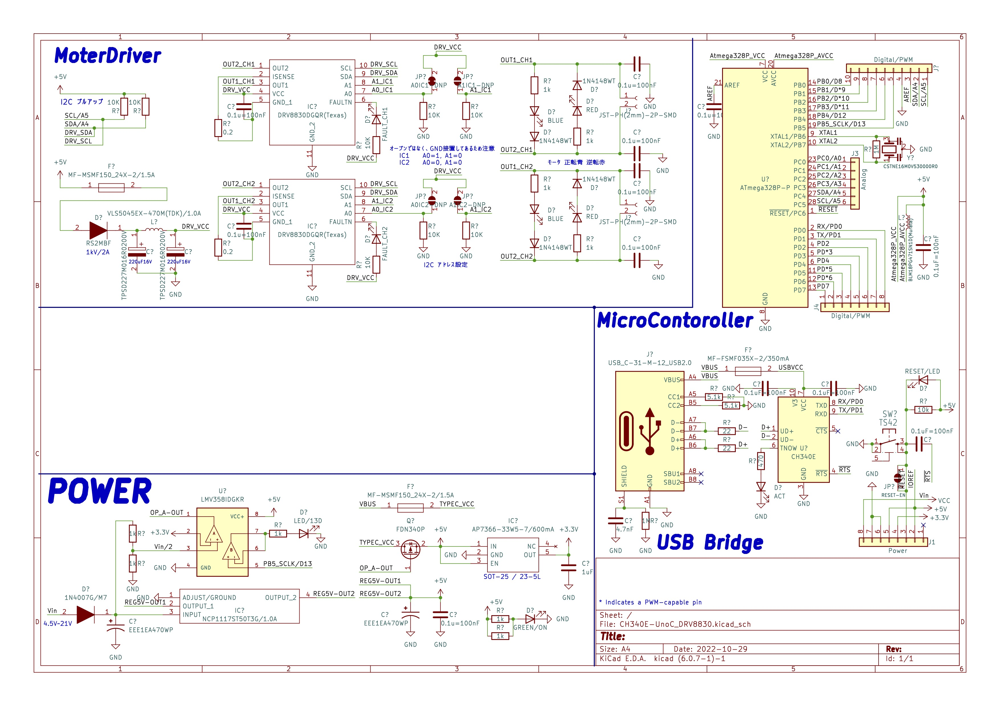

# KiCad6_CH340E_UnoC_DRV8830

ArduinoUno互換機です。
変更点は以下の通り

|概要| 従来 |->| 変更 |
| :-: | :-:   | :-: |:-: |
|USBポート|USB-B | -> | Type-C|
|シリアル変換IC| ATMEGA16U2|->|CH340E|
|モータドライバ| - | -> | DRV8830

# Overview

ArduinoUno互換機です。   
回路図は[Arduino公式](https://store.arduino.cc/products/arduino-uno-rev3)の [UNO-TH_Rev3e.sch ⤴️](https://content.arduino.cc/assets/UNO-TH_Rev3e_sch.pdf)を参考にしています。   
従来のUSB-BコネクタからType-Cへ置き換え、モータドライバDRV8830を2個 組み込んだ基板になっています。  
また従来のシリアル変換ICとして使用されているATMEGA16U2が入手困難な為、代わりに秋月電子通商で入手のしやすい[CH340E]()を使用しています。

CH340Eを使用した回路図は同じく秋月電子通商で販売されているモジュール [AE-CH340E-TYPEC ⤴️](https://akizukidenshi.com/catalog/g/gK-14745/)を参考にしています。

# Datasheet

|メーカ |ホームページ| データシートURL
|--| :-:|:-:| 
|WCH [Jiangsu Haoheng Co., Ltd.]|http://wch.cn/ |[CH340 ⤴️](https://www.wch.cn/downloads/CH340DS1_PDF.html) |
|Texas Instruments|https://www.ti.com/|[DRV8830 ⤴️](https://www.ti.com/product/ja-jp/DRV8830)|

# Hardware

## Schematics

## Board IO
